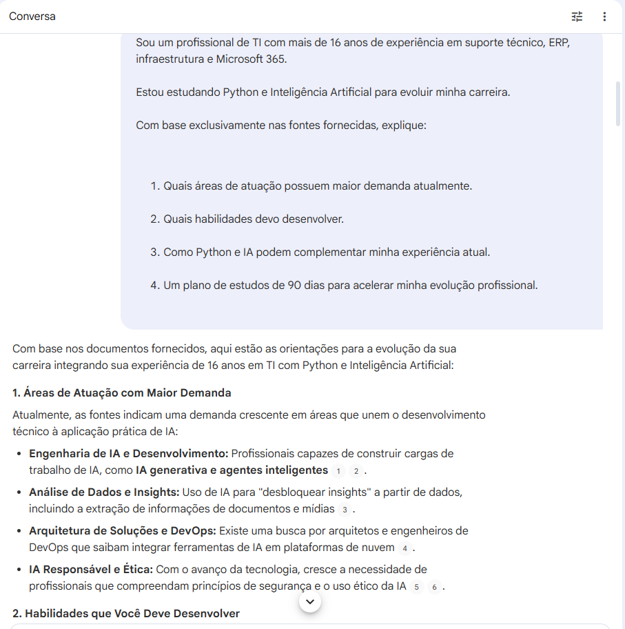
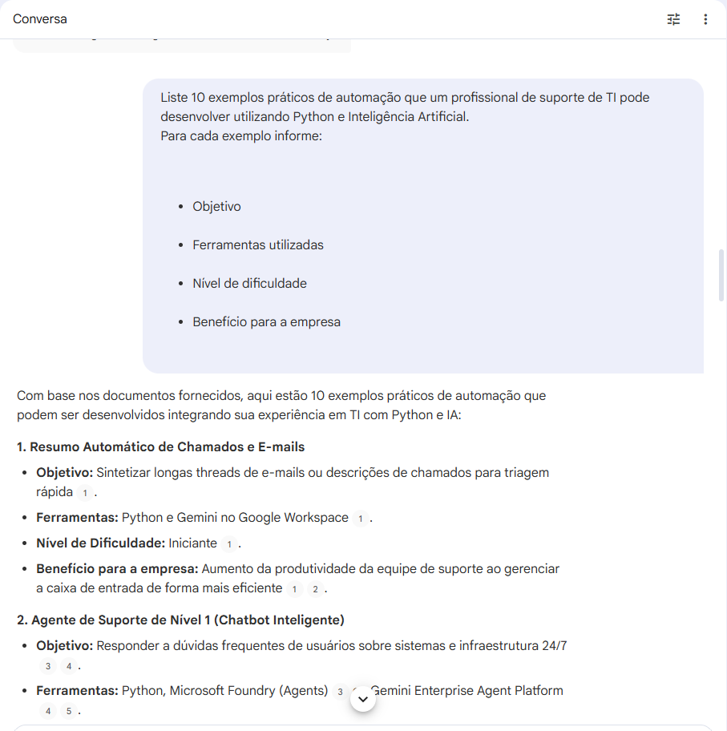
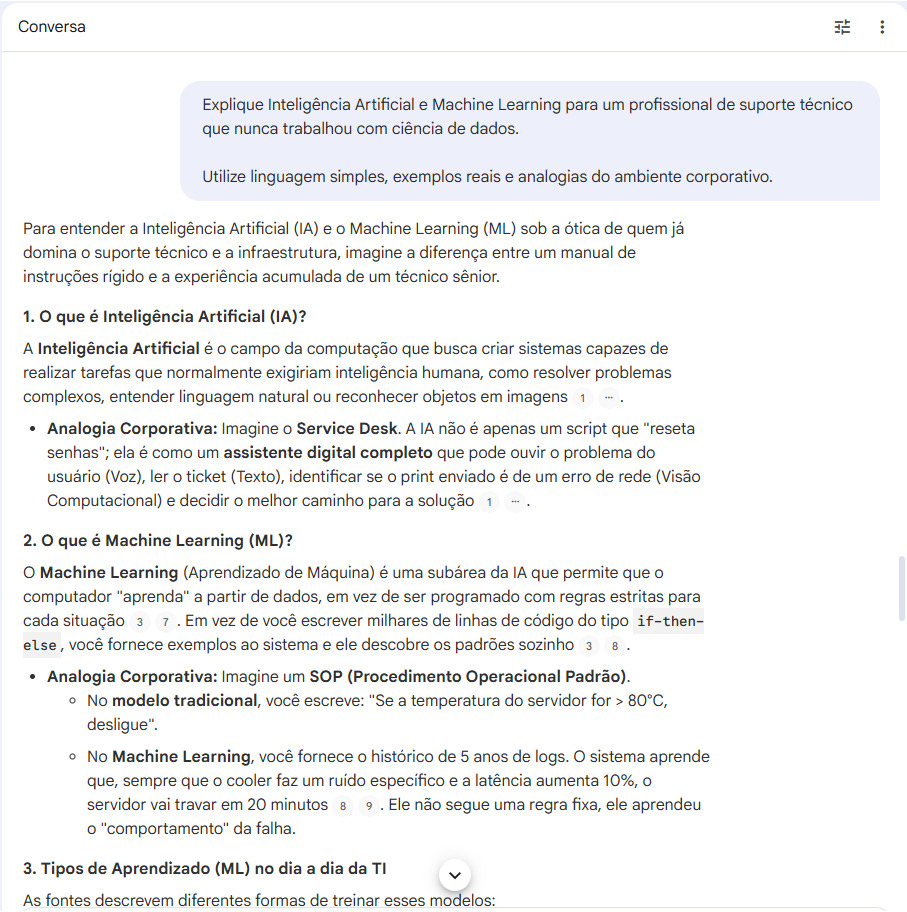
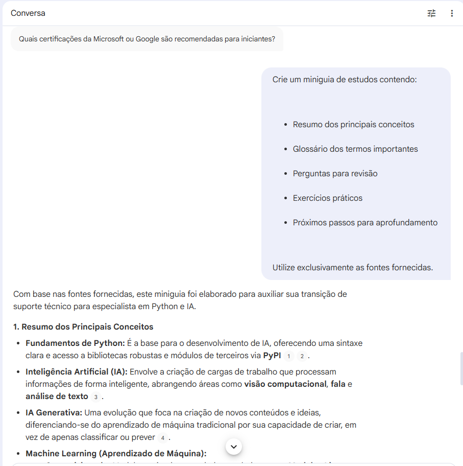

# Treinando uma IA de Aprendizagem: Explorando o Poder do NotebookLM

## 📖 Sobre o Projeto

Este projeto foi desenvolvido como parte do desafio da DIO **"Treinando uma IA de Aprendizagem: Explore o Poder do NotebookLM"**.

O objetivo foi utilizar o NotebookLM como ferramenta de aprendizagem ativa para estudar a aplicação de **Python e Inteligência Artificial na automação de processos de TI**, consolidando conhecimento por meio de fontes confiáveis, engenharia de prompts e construção de um miniguia de estudos.

---

## 🎯 Objetivos de Estudo

* Compreender os fundamentos de Inteligência Artificial.
* Entender o papel do Python no desenvolvimento de soluções de IA.
* Identificar oportunidades de aplicação prática da IA em ambientes corporativos.
* Explorar automações voltadas para profissionais de suporte técnico e infraestrutura.
* Criar um material de revisão e aprendizado contínuo.

---

## 📚 Curadoria de Fontes

As seguintes fontes foram utilizadas e importadas para o NotebookLM:

1. Python Documentation

   * https://docs.python.org/3/

2. Scikit-Learn User Guide

   * https://scikit-learn.org/stable/user_guide.html

3. Google AI Education

   * https://ai.google/education/

4. Microsoft Learn – AI Applications and Agents

   * https://learn.microsoft.com/training/paths/get-started-with-artificial-intelligence-on-azure/

5. IBM SkillsBuild

   * https://skillsbuild.org/

### Evidência das Fontes Utilizadas

---

## 🧠 Engenharia de Prompts

### Prompt 1 – Mercado e Evolução Profissional

**Objetivo:** identificar áreas promissoras, habilidades necessárias e elaborar um plano de estudos.

**Aprendizados:**

* Crescente demanda por Engenharia de IA.
* Expansão das áreas de análise de dados.
* Importância da IA Generativa.
* Necessidade de dominar Python.
* Valorização de certificações profissionais.

---

### Prompt 2 – Aplicações Práticas

**Objetivo:** descobrir automações aplicáveis ao dia a dia de profissionais de TI.

**Destaques:**

* Chatbots inteligentes.
* Resumo automático de chamados.
* Extração de dados de documentos.
* Detecção de anomalias.
* Busca inteligente em documentação técnica.

---

### Prompt 3 – IA e Machine Learning Simplificados

**Objetivo:** compreender os conceitos de IA utilizando analogias do ambiente corporativo.

**Aprendizados:**

* Diferença entre IA e Machine Learning.
* Aprendizado supervisionado.
* Aprendizado não supervisionado.
* IA Generativa.
* Importância do Python como linguagem principal.

---

### Prompt 4 – Construção do Miniguia

**Objetivo:** consolidar o conhecimento em um guia estruturado para futuras revisões.

**Resultado:**

* Resumos.
* Glossário.
* Perguntas de revisão.
* Exercícios práticos.
* Próximos passos de estudo.

---

## 🔧 Cicatrizes (Troubleshooting)

Durante os testes, alguns aprendizados importantes foram identificados:

* Prompts genéricos produzem respostas mais superficiais.
* Fornecer contexto profissional gera respostas mais relevantes.
* Solicitar estruturas específicas melhora significativamente a organização das respostas.
* Utilizar exemplos do ambiente corporativo facilita a compreensão de conceitos complexos.

---

## 📘 Miniguia de Estudos

### Principais Conceitos

* Python como base para automação e IA.
* Machine Learning supervisionado e não supervisionado.
* IA Generativa.
* Agentes Inteligentes.
* Extração de informações por IA.

### Glossário

| Termo                  | Definição                                  |
| ---------------------- | ------------------------------------------ |
| LLM                    | Modelo de linguagem de grande escala       |
| Prompt Tuning          | Ajuste de prompts para melhorar respostas  |
| Scikit-Learn           | Biblioteca Python para Machine Learning    |
| Information Extraction | Extração estruturada de dados              |
| Cross Validation       | Técnica de validação de modelos            |
| Pipeline               | Fluxo organizado de processamento de dados |

### Perguntas para Revisão

1. Qual a diferença entre IA Generativa e Machine Learning tradicional?
2. O que é aprendizado supervisionado?
3. Como o Python é utilizado em projetos de IA?
4. O que caracteriza um agente inteligente?
5. Qual o papel da biblioteca Scikit-Learn?

### Exercícios Práticos

* Criar um script para resumir chamados de suporte.
* Treinar um modelo simples utilizando Scikit-Learn.
* Desenvolver uma análise de sentimento para feedbacks de usuários.
* Explorar recursos de IA em plataformas de nuvem.

### Próximos Passos

* Estudar IA Generativa em maior profundidade.
* Explorar agentes inteligentes.
* Preparar-se para certificações de IA.
* Desenvolver projetos práticos utilizando Python.

---

## ✅ Conclusão

O NotebookLM demonstrou ser uma poderosa ferramenta de aprendizagem ativa, permitindo organizar informações, criar materiais de estudo, consolidar conhecimento e explorar conceitos complexos de forma prática e contextualizada.

A experiência mostrou que a combinação entre boas fontes, engenharia de prompts e pensamento crítico potencializa significativamente o processo de aprendizado com Inteligência Artificial.
